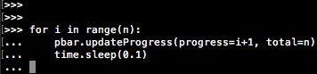

### *General tools for general projects*

See below for usage on the different tools:

# Table of Contents

- [text_hist](#text_hist)
- [text_scatter](#text_scatter)
- [pubmed_PMC_querier](#pubmed_PMC_querier)
- [seq_logos](#seq_logos)
- [progress_bar](#progress_bar)
- [sequence_reader](#sequence_reader)


## text_hist

Produce an ASCII histogram from an array of data.

This script can be used either as a module in a script, or as a standalone command line tool. The basic usage is to provide an array of numbers to the function. Additionally you may specify the number of bins you want across the x-values.

**Module Parameters:**

- `x`: _required_. An array or list with shape (n,) containing the data. 
- `bins`: _optional_. The number of bins across the x-axis. (Default `10`)

**CLI Parameters**

```
usage: text_hist.py [-h] [-b BINS] [input]

Generate an ASCII based histogram from a one column file.

positional arguments:
  input                 A file with one column of numbers. Defaults to STDIN
                        if not specified.

optional arguments:
  -h, --help            show this help message and exit
  -b BINS, --bins BINS  The number of bins across the x-axis. (Default: 10)
```

**Usage:**

As module

```python
>>> # Generate some random data
>>> import scipy as sp
>>> import numpy as np
>>> np.random.seed(seed=233423)
>>> x = sp.random.standard_normal(size=100)
>>> 
>>> # Generate the plot
>>> import text_hist
>>> text_hist.main(x, bins=50)
```
```
 9.00|                                                  
 8.10|                   #                              
 7.20|                   #                              
 6.30|                 # #      #   #                   
 5.40|                 # #     ##   #                   
 4.50|                 # ##    ##   #                   
 3.60|               ######  # ##   #                   
 2.70|           ### ####### ##### ###                  
 1.80|        #  ### ####### ######### #    #           
 0.90|#     # ###### ################### #  #   # # #  #
 0.00+-------------------------------------------------+
     -2.57785345583                                  3.00170352365
```

From the command line, using `numbers.txt`, which has the exact same values as we used above in a single column.

```
$ python text_hist.py numbers.txt 50
```
```
 9.00|                                                  
 8.10|                   #                              
 7.20|                   #                              
 6.30|                 # #      #   #                   
 5.40|                 # #     ##   #                   
 4.50|                 # ##    ##   #                   
 3.60|               ######  # ##   #                   
 2.70|           ### ####### ##### ###                  
 1.80|        #  ### ####### ######### #    #           
 0.90|#     # ###### ################### #  #   # # #  #
 0.00+-------------------------------------------------+
     -2.57785345583                                  3.00170352365
```

## text_scatter

Produce an ASCII scatter plot or 2D density plot from an array of data.

This script can be used either as a module in a script, or as a standalone command line tool. The basic usage is to provide an array of numbers to the function, and plot type (density or scatter). Additionally you may specify the height of the plot (in number of characters).

**Module Parameters:**

- `x`, `y`: _required_. Each `x` and `y` should be an array or list with shape (n,) containing the data to be plotted.. 
- `plot_type`: _optional_. The type of plot you would like. Use `scatter` for a traditional scatterplot, or `density` where the plotted points will represent the number of points being plotted in a given cell. (Default `scatter`)
- `plot_height`: _optional_. The number of characters tall the plot is. Determines the size of the plot and level of binning of values. (Default is `20`)
- `sharesize`: _optional_. If `True`, the limits of the x and y axes will be the same. (Default is `False`)

> **NOTE:** Given the limitations of ASCII text, the values 
> are binned before they are plotted. Therefore, you may 
> have many points overlapping in the `scatter` version of
> the plot. It is useful for seeing general trends, but 
> not necessarily for seeing the bulk of your points. If 
> that's important, use the `density` version to see 
> where overlaps are occuring.

**CLI Parameters:**

```
usage: text_scatter.py [-h] [-y HEIGHT] [-t {scatter,density}] [--xy-lim]
                       [input]

Generate an ASCII based scatterplot from a two column file.

positional arguments:
  input                 A file with two columns of numbers separated by
                        whitespace. Defaults to STDIN if not specified.

optional arguments:
  -h, --help            show this help message and exit
  -y HEIGHT, --height HEIGHT
                        The number of characters tall the plot will be.
                        Determines the plot size. (Default: 20)
  -t {scatter,density}, --type {scatter,density}
                        Whether to generate a scatter plot or a density plot.
                        (Default: scatter)
  --xy-lim              make the x and y limits have the same axis limits.
```

**Usage:**

As module

```python
>>> # Generate some data
>>> import numpy as np
>>> np.random.seed(seed=233423)
>>> x = np.linspace(0, 10, 100)
>>> y = x + np.random.random(100)
>>> 
>>> # Generate the plot using defaults
>>> import text_scatter
>>> text_scatter.main(x,y)
```
```
 10.70+                                              ****
      |                                            **  **
      |                                          *  **   
      |                                        *****     
      |                                     *****        
      |                                 * *  *           
      |                                *****             
      |                             ****                 
      |                            ***                   
      |                        *****                     
      |                       ****                       
      |                   * ***                          
      |                 ******                           
      |              *****                               
      |            * ***                                 
      |        * ****                                    
      |       ****                                       
      |    * **                                          
      |* *****                                           
      |***                                               
  0.43+-------------------------------------------------+
      0.0                                             10.01
```
```python
>>> # Change the plot size
>>> text_scatter.main(x,y, plot_height=10)
```
```
 10.70+                      ***
      |                    **** 
      |                *****    
      |              *****      
      |            ****         
      |         *****           
      |       *****             
      |    *****                
      |  ****                   
      |****                     
  0.43+------------------------+
      0.0                    10.01
```
```python
>>> # Change the plot type
>>> text_scatter.main(x,y, plot_height=10, plot_type='density')
```
```
 10.70+                      =#@  @  4.00e+00
      |                    =@=:   %  3.60e+00
      |                ::=@=      #  3.20e+00
      |              :###=        *  2.80e+00
      |            =##:           +  2.40e+00
      |         ::#=:             =  2.00e+00
      |       =###:               -  1.60e+00
      |    :#@=:                  :  1.20e+00
      |  :##:                     .  8.01e-01
      |@@#:                          4.00e-01
  0.43+------------------------+
      0.0                    10.01
```

From the command line, using `numbers.txt`, which has the exact same values as we used above in two columns.

```
$ python text_scatter.py numbers.txt -t density -y 10
```
```
 10.70+                      =#@  @  4.00e+00
      |                    =@=:   %  3.60e+00
      |                ::=@=      #  3.20e+00
      |              :###=        *  2.80e+00
      |            =##:           +  2.40e+00
      |         ::#=:             =  2.00e+00
      |       =###:               -  1.60e+00
      |    :#@=:                  :  1.20e+00
      |  :##:                     .  8.01e-01
      |@@#:                          4.00e-01
  0.43+------------------------+
      0.0                    10.01
```

## pubmed_PMC_querier

[pubmed_PMC_querier](https://github.com/pdeford/tools/blob/master/pubmed_PMC_querier.py) is a tool that lets you query NCBI's PubMed database, take the resulting PMIDs, converts them to PMCIDs, and uses those to download the full text for all of the articles whose text is freely available. It also downloads the front matter (title, abstract, authors, etc.) for all available articles.

**Usage:**

    $ ~/tools/pubmed_PMC_querier.py outputFileBasename "your search query[&additional=options]"

**Example output:**

    $ ~/tools/pubmed_PMC_querier.py nonRed_enhancers  "human cis regulatory elements enhancers&mindate=2001"
    Querying PMC for 'human cis regulatory elements enhancers&mindate=2001'
    PMIDs: 317
    Converting PMIDs to PMCIDs
    PMCIDs: 127
    Downloading full text of articles. Minimum time = 0.7 minutes
    Full text retrieved for 59 articles
    
    real	1m3.847s
    user	0m0.695s
    sys 	0m0.975s

    $ ls
    nonRed_enhancers.articles.txt	parser_log

## seq_logos

[PWM_logo](https://github.com/pdeford/tools/blob/master/seq_logos/PWM_logo.py) is a module
for creating quick and dirty sequence logos for a given PWM.

**Usage:**

```python
#!/usr/bin/env python

import PWM_logo

pwm = """0.00 4000.00  27.00 3887.00 3550.00 799.00 
0.00   0.00  29.00   0.00   4.00 681.00 
4000.00   0.00 109.00   6.00 383.00 2296.00 
0.00   0.00 3835.00 107.00  63.00 224.00"""

PWM_logo.main(pwm)
```


[gui](https://github.com/pdeford/tools/blob/master/seq_logos/gui.py) provides a quick GUI 
for generating these logos on the fly, outside of a python script.

## progress_bar

Create an ASCII progress bar based on progress towards a goal.

**Usage:**

```
import time
from progress_bar import progress_bar

pbar = progress_bar(length=30)
n = 100
for i in range(n):
    pbar.updateProgress(progress=i+1, total=n)
    time.sleep(0.1)
```



## sequence_reader

Works with sequence files in a few ways:

- Reads in a FASTA file and returns the sequences as a list of strings.
    + Doesn't return headers
- Reads in a BED file and returns the chromosome positions as a list of tuples.
    + Ignores strand information, names, etc. Only chr, start, end.
- Given a genomic region, can extract the sequence from a FASTA file.
    + Assumes that the FASTA sequence is formatted with one file for each chromosome.
    + Assume 50 bp per line in the FASTA file.